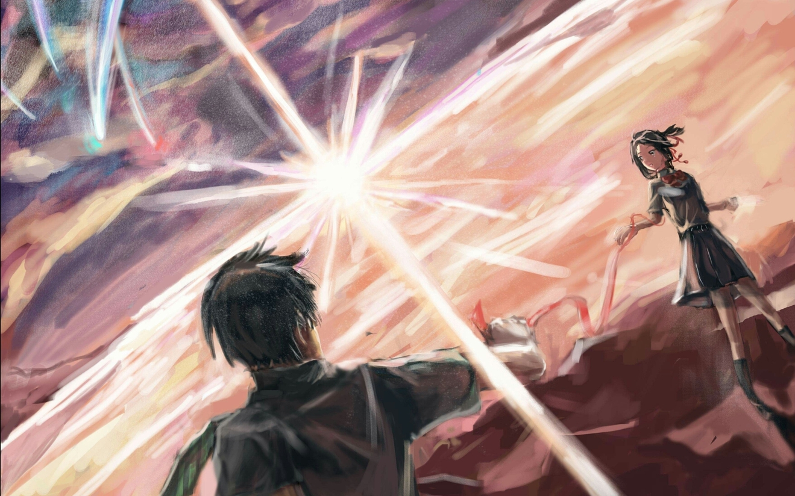
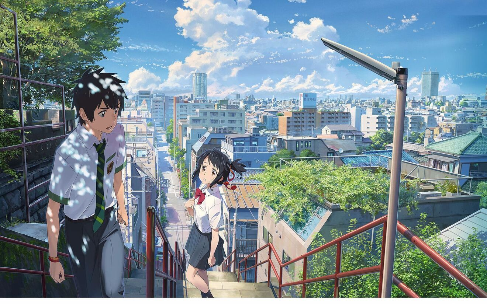
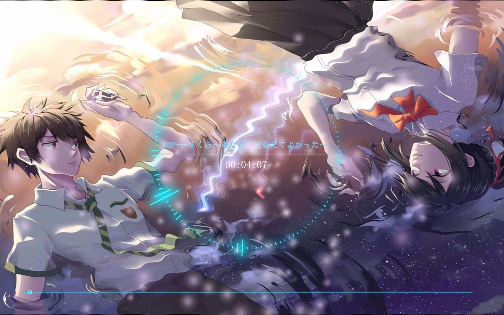
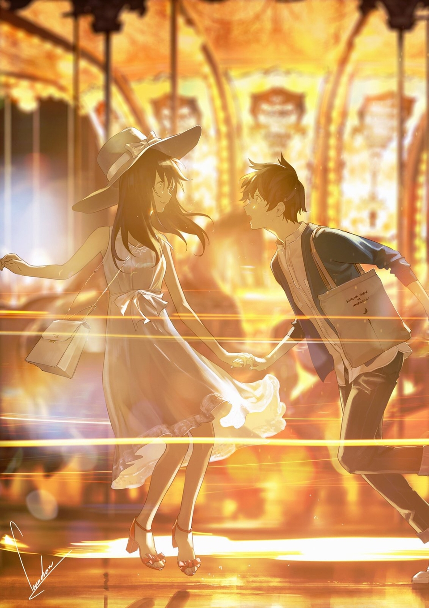
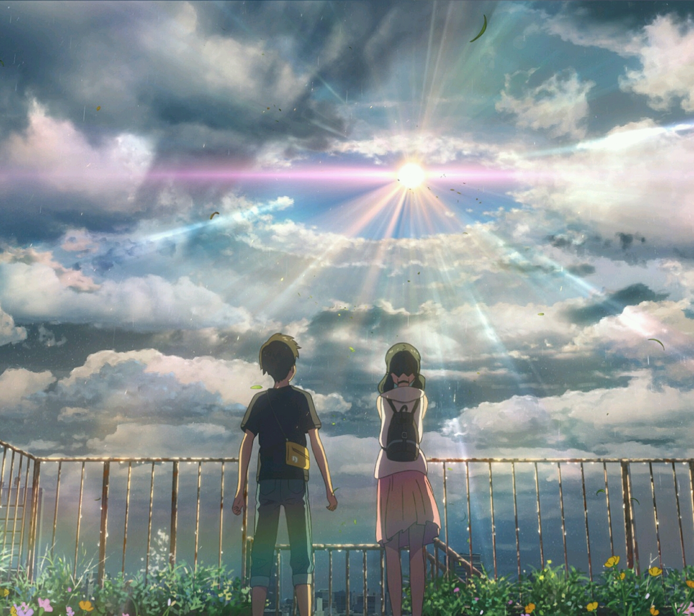
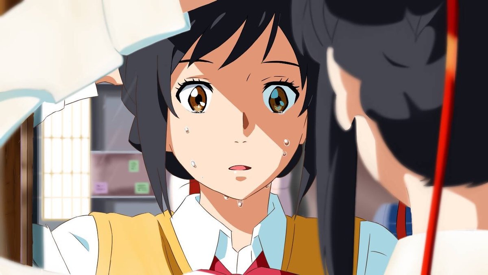
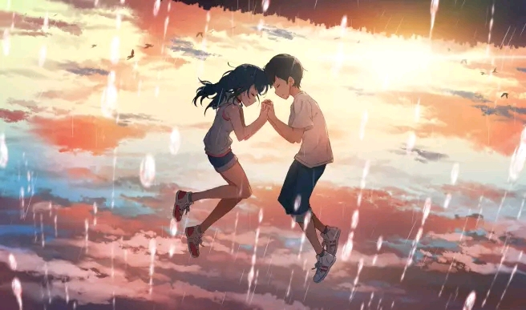

<!DOCTYPE html>
<html lang="zxx">
<head>
<title>Home</title>
<!-- Meta tag Keywords -->
<meta name="viewport" content="width=device-width, initial-scale=1">
<meta http-equiv="Content-Type" content="text/html; charset=utf-8" />
<meta name="keywords" content="" />

<!--// Meta tag Keywords -->
<!-- css files -->
<link rel="stylesheet" href="css/bootstrap.css"> <!-- Bootstrap-Core-CSS -->
<link rel="stylesheet" href="css/style.css" type="text/css" media="all" /> <!-- Style-CSS --> 
<link rel="stylesheet" href="css/font-awesome.css"> <!-- Font-Awesome-Icons-CSS -->
<!-- //css files -->
<!-- online-fonts -->
<link href="http://fonts.googleapis.com/css?family=Economica:400,400i,700,700i&amp;subset=latin-ext" rel="stylesheet">
<link href="http://fonts.googleapis.com/css?family=Exo:100,100i,200,200i,300,300i,400,400i,500,500i,600,600i,700,700i,800,800i,900,900i&amp;subset=latin-ext" rel="stylesheet">
<!-- //online-fonts -->
</head>
<body> 

	<!-- banner -->
	

		

				<input class="search_box" type="checkbox" id="search_box">
				<label class="icon-search" for="search_box"></label>
				

					<form action="#" method="post">
						<input type="search" name="Search" placeholder="Search Here......." required=""id="message2">
						<input type="submit" value="Send" onclick="lovefunction2()">
					</form>
				

		

		

			
<i class="fa fa-phone" aria-hidden="true"></i>	QQ+XXX XXXX XXX
<!--自己QQ或者手机号-->
		

		

		

			

				<h1><a href="index.html">Happy valentine's day</a></h1>
			

			

			<!-- navigation --> 
				<button type="button" class="navbar-toggle collapsed" data-toggle="collapse" data-target="#bs-example-navbar-collapse-1">
					Toggle navigation
					
					
					
				</button>
				

					<!-- Collect the nav links, forms, and other content for toggling -->
					
					
						<ul class="nav navbar-nav navbar-left">
							<li class="active"><a href="index.html">HOME</a></li>
							<li><a href="#about" class="link link--yaku scroll">ABOUT</a></li>
							<li><a href="#news" class="link link--yaku scroll">NEWS</a></li>
							<li><a href="#planners" class="link link--yaku scroll">PLANNERS</a></li>
							<li><a href="#gallery" class="link link--yaku scroll">GALLERY</a></li>
							<li><a href="#contact" class="link link--yaku scroll">CONTACT US</a></li>
						</ul>		
						
 

					
<!-- //navigation -->
			

		

		
 

		

		
 

	

			<!-- banner-text -->
			

				

					<ul class="rslides callbacks callbacks1" id="slider4">
						<li>
							

							

								

									

										<h4>Sonnet 116</h4>
										<h3>William Shakespeare</h3>
										
Love alters not with his brief hours and weeks

										<h5><a href="#" class="view rew3" data-toggle="modal" data-target="#myModal5">More Affection</a></h5>
									
	
								

							

							

						</li>
						<li>
							

							

								

									

										<h4>She Walks in Beauty</h4>
										<h3>Lord Byron</h3>
										
She walks in beauty, like the night 

										<h5><a href="#" class="view rew3" data-toggle="modal" data-target="#myModal5">More Affection</a></h5>
									
	
								

							

							

						</li>
					</ul>
				

				
 

				<!-- //banner-text -->
			

			
		

			

				

								<ul>
									<li class="f1">
										<a href="#" class="hvr-grow"><i class="fa fa-facebook f1" aria-hidden="true"></i></a>
									</li>
									<li class="f2">
										<a href="#" class="hvr-grow"><i class="fa fa-google-plus f2" aria-hidden="true"></i></a>
									</li>
									<li class="f3">
										<a href="#" class="hvr-grow"><i class="fa fa-twitter f3" aria-hidden="true"></i></a>
									</li>
									<li class="f4">
										<a href="#" class="hvr-grow"><i class="fa fa-linkedin f5" aria-hidden="true"></i></a>
									</li>
									<li class="f5">
										<a href="#" class="hvr-grow"><i class="fa fa-dribbble f6" aria-hidden="true"></i></a>
									</li>
								</ul>
				

			

		

						<!-- Modal5 -->
						

							

							<!-- Modal content-->
								

									

										<button type="button" class="close" data-dismiss="modal">&times;</button>
											<h4>Valentine</h4>
											<h5>But bears it out even to the edge of doom</h5>
											
											If this be error and upon me proved.I never writ, nor no man ever loved. 
									

								

						
							

				        

						<!-- //Modal5 -->

<!-- //banner -->
<!-- main -->

		<!-- About -->
		

			

				

					<h3 class="w3_tittle">About Us </h3>
					

						

							

								

									
								

								

									<h4>Valentine</h4>
									
loved you first: but afterwards your love...

								

							

						

						

							<h4>Christina Rossetti </h4>
							
I loved you first, but afterwards your love outsoaring mine.For one is both and both are one in love

							
Rich love knows nought of ‘thine that is not mine.Both have the strength and both the length thereof.Both of us, of the love which makes us one

						

						

					

				

			

		

		<!-- //About -->

<!-- Services -->

		

				

					<h4>A Glimpse</h4>
					<h5>By Walt Whitman</h5>
					
A long while amid the noises of coming and going,of drinking and oath and smutty jest, 
					There we two, content, happy in being together,speaking little, perhaps not a word.  

					<ul>
						<li><a href="#"><i class="glyphicon glyphicon-ok"></i>I always remember that day</a></li>
						<li><a href="#"><i class="glyphicon glyphicon-ok"></i>when I met you</a></li>
						<li><a href="#"><i class="glyphicon glyphicon-ok"></i>I love you</a></li>
						<li><a href="#"><i class="glyphicon glyphicon-ok"></i>Grow old along with me! Thebest is yet to be" </a></li>
					</ul>
				

		

		

			

				

					<i class="fa fa-birthday-cake" aria-hidden="true"></i>
					<h4>Love cakes</h4>
					
"For you see, each dayI love you more. Today more than yesterday and less than tomorrow"

				

				

					<i class="fa fa-gratipay" aria-hidden="true"></i>
					<h4>Emotional</h4>
					
No matter the ending is perfect or not, you cannot disappear from my world.

				

				

					<i class="fa fa-glass" aria-hidden="true"></i>
					<h4>Celebrations</h4>
					
If you weeped for the missing sunset,you would miss all the shining stars. 

				

			

		
	
		
 

		  
<!-- //Services -->

	<!-- News -->
	

		

			

				<h3 class="w3_tittle">Our News & Events </h3>
			

			

				

					

						
					

					

						<a href="#" class="rew3" data-toggle="modal" data-target="#myModal1"><h4>Jack & Rose</h4></a>
						
The beginning of our story

						<h6>Feb 14 2020</h6>
						<h5>00:00am</h5>
					

					

						<a href="#" class="rew3" data-toggle="modal" data-target="#myModal1">Bright Star by John Keats</a>
						
Bright star, would I were steadfast as thou artNot in lone splendour hung aloft the night, And watching, with eternal lids apart.

						<a href="#" class="view new-w3" data-toggle="modal" data-target="#myModal5">Read More</a>
					

				

				

					
					<iframe src="images/index.html" style="height: 570px;width: 515px;"></iframe>
				

				
 

			

		

	

	
	
	

								
						<!-- Modal1 -->
						

							

							<!-- Modal content-->
								

									

										<button type="button" class="close" data-dismiss="modal">&times;</button>
											<h4>conjugality</h4>
											<h5>Our Top News</h5>
											
											Lorem ipsum dolor sit amet, Sed ut perspiciatis unde omnis iste natus error sit voluptatem , eaque ipsa quae ab illo inventore veritatis et quasi architecto beatae vitae dicta sunt explicabo.accusantium doloremque laudantium, totam rem aperiamconsectetur adipiscing elit, sed do eiusmod tempor incididunt ut labore et dolore magna aliqua.
									

								

						
							

				       

						<!-- //Modal1 -->
				
						<!-- Modal2 -->
						

							

							<!-- Modal content-->
								

									

										<button type="button" class="close" data-dismiss="modal">&times;</button>
											<h4>conjugality</h4>
											<h5>Our Top News</h5>
											
											Lorem ipsum dolor sit amet, Sed ut perspiciatis unde omnis iste natus error sit voluptatem , eaque ipsa quae ab illo inventore veritatis et quasi architecto beatae vitae dicta sunt explicabo.accusantium doloremque laudantium, totam rem aperiamconsectetur adipiscing elit, sed do eiusmod tempor incididunt ut labore et dolore magna aliqua.
									

								

						
							

				       

					<!-- //Modal2 -->
	<!-- //News -->

	<!-- team -->
	
		
		

			<h3 class="w3_tittle">On A Date</h3>    
			

				

					

						
						

							

								<h4>Date</h4>
								<h6>Morning</h6>
								
Your plan

							
 
							

								<a href="#" class="social-button twitter"><i class="fa fa-twitter"></i></a>
								<a href="#" class="social-button facebook"><i class="fa fa-facebook"></i></a> 
								<a href="#" class="social-button google"><i class="fa fa-google-plus"></i></a>  
							

						
 
					

				

				

					

						
						

							

								<h4>Date</h4>
								<h6>Afternoon</h6>
								
Your plan

							

							

								<a href="#" class="social-button twitter"><i class="fa fa-twitter"></i></a>
								<a href="#" class="social-button facebook"><i class="fa fa-facebook"></i></a> 
								<a href="#" class="social-button google"><i class="fa fa-google-plus"></i></a>  
							
	
						
 
					

				

				

					

						
						

							

								<h4>Date</h4>
								<h6>Evening</h6>
								
Your plan

							
	
							

								<a href="#" class="social-button twitter"><i class="fa fa-twitter"></i></a>
								<a href="#" class="social-button facebook"><i class="fa fa-facebook"></i></a> 
								<a href="#" class="social-button google"><i class="fa fa-google-plus"></i></a>  
							
	
						
 
					

				

				

					

						
						

							

								<h4>Date</h4>
								<h6>Night</h6>	
								
Your plan

							
	
							

								<a href="#" class="social-button twitter"><i class="fa fa-twitter"></i></a>
								<a href="#" class="social-button facebook"><i class="fa fa-facebook"></i></a> 
								<a href="#" class="social-button google"><i class="fa fa-google-plus"></i></a>  
							
	
						
 
					

				

				
 

			

		

	

	<!-- //team --> 

	<!-- gallery -->
	

		

		<h3 class="w3_tittle">Our Gallery</h3>
			

				

					

						<a href="#portfolioModal1" class="b-link-stripe b-animate-go wow zoomIn animated" data-wow-delay=".5s" data-toggle="modal">
							
							

								
									
													
							

						</a>
					

					

						

							<a href="#portfolioModal2" class="b-link-stripe b-animate-go wow zoomIn animated" data-wow-delay=".5s" data-toggle="modal">
								
								

									
										
														
								

							</a>
						

					

					

						

							<a href="#portfolioModal3" class="b-link-stripe b-animate-go wow zoomIn animated" data-wow-delay=".5s" data-toggle="modal">
								
								

									
										
														
								

							</a>
						

					

					

				

				

					

						<a href="#portfolioModal4" class="b-link-stripe b-animate-go wow zoomIn animated" data-wow-delay=".5s" data-toggle="modal">
							
							

								
									
													
							

						</a>
					

					

						

							<a href="#portfolioModal5" class="b-link-stripe b-animate-go wow zoomIn animated" data-wow-delay=".5s" data-toggle="modal">
								
								

									
										
														
								

							</a>
						

					

					

						

							<a href="#portfolioModal6" class="b-link-stripe b-animate-go wow zoomIn animated" data-wow-delay=".5s" data-toggle="modal">
								
								

									
										
														
								

							</a>
						

						

							<a href="#portfolioModal7" class="b-link-stripe b-animate-go wow zoomIn animated" data-wow-delay=".5s" data-toggle="modal">
								
								

									
										
														
								

							</a>
						

					

					

				

				

					

						<a href="#portfolioModal8" class="b-link-stripe b-animate-go wow zoomIn animated" data-wow-delay=".5s" data-toggle="modal">
							
							

								
									
													
							

						</a>
					

					

						

							<a href="#portfolioModal9" class="b-link-stripe b-animate-go wow zoomIn animated" data-wow-delay=".5s" data-toggle="modal">
								
								

									
										
														
								

							</a>
						

					

					

						

							<a href="#portfolioModal10" class="b-link-stripe b-animate-go wow zoomIn animated" data-wow-delay=".5s" data-toggle="modal">
								
								

									
										
														
								

							</a>
						

					

					

				

				<!-- gallery Modals -->
				

					

						

							

								

							

						

						

							

								

									

										<h3>Our Gallery</h3>
										

										
										
I seem to have loved you in numberless forms, numberless times。
In life after life, in age after age, forever.
My spellbound heart has made and remade the necklace of songs,
That you take as a gift, wear round your neck in your many forms,
In life after life, in age after age, forever.
Whenever I hear old chronicles of love, it's age-old pain,
It's ancient tale of being apart or together.
As I stare on and on into the past, in the end you emerge,
Clad in the light of a pole-star piercing the darkness of time:
You become an image of what is remembered forever.
You and I have floated here on the stream that brings from the fount.
At the heart of time, love of one for another.
We have played along side millions of lovers, shared in the same
Shy sweetness of meeting, the same distressful tears of farewell
Old love but in shapes that renew and renew forever.
Today it is heaped at your feet, it has found its end in you
The love of all man’s days both past and forever
Universal joy, universal sorrow, universal life.
The memories of all loves merging with this one love of ours–
And the songs of every poet past and forever.

									

								

							

						

					

				

				

					

						

							

								

							

						

						

							

								

									

										<h3>Our Gallery</h3>
										

										
										
I seem to have loved you in numberless forms, numberless times。
In life after life, in age after age, forever.
My spellbound heart has made and remade the necklace of songs,
That you take as a gift, wear round your neck in your many forms,
In life after life, in age after age, forever.
Whenever I hear old chronicles of love, it's age-old pain,
It's ancient tale of being apart or together.
As I stare on and on into the past, in the end you emerge,
Clad in the light of a pole-star piercing the darkness of time:
You become an image of what is remembered forever.
You and I have floated here on the stream that brings from the fount.
At the heart of time, love of one for another.
We have played along side millions of lovers, shared in the same
Shy sweetness of meeting, the same distressful tears of farewell
Old love but in shapes that renew and renew forever.
Today it is heaped at your feet, it has found its end in you
The love of all man’s days both past and forever
Universal joy, universal sorrow, universal life.
The memories of all loves merging with this one love of ours–
And the songs of every poet past and forever.

									

								

							

						

					

				

				

					

						

							

								

							

						

						

							

								

									

										<h3>Our Gallery</h3>
										

										
										
I seem to have loved you in numberless forms, numberless times。
In life after life, in age after age, forever.
My spellbound heart has made and remade the necklace of songs,
That you take as a gift, wear round your neck in your many forms,
In life after life, in age after age, forever.
Whenever I hear old chronicles of love, it's age-old pain,
It's ancient tale of being apart or together.
As I stare on and on into the past, in the end you emerge,
Clad in the light of a pole-star piercing the darkness of time:
You become an image of what is remembered forever.
You and I have floated here on the stream that brings from the fount.
At the heart of time, love of one for another.
We have played along side millions of lovers, shared in the same
Shy sweetness of meeting, the same distressful tears of farewell
Old love but in shapes that renew and renew forever.
Today it is heaped at your feet, it has found its end in you
The love of all man’s days both past and forever
Universal joy, universal sorrow, universal life.
The memories of all loves merging with this one love of ours–
And the songs of every poet past and forever.

									

								

							

						

					

				

				

					

						

							

								

							

						

						

							

								

									

										<h3>Our Gallery</h3>
										

										
										
I seem to have loved you in numberless forms, numberless times。
In life after life, in age after age, forever.
My spellbound heart has made and remade the necklace of songs,
That you take as a gift, wear round your neck in your many forms,
In life after life, in age after age, forever.
Whenever I hear old chronicles of love, it's age-old pain,
It's ancient tale of being apart or together.
As I stare on and on into the past, in the end you emerge,
Clad in the light of a pole-star piercing the darkness of time:
You become an image of what is remembered forever.
You and I have floated here on the stream that brings from the fount.
At the heart of time, love of one for another.
We have played along side millions of lovers, shared in the same
Shy sweetness of meeting, the same distressful tears of farewell
Old love but in shapes that renew and renew forever.
Today it is heaped at your feet, it has found its end in you
The love of all man’s days both past and forever
Universal joy, universal sorrow, universal life.
The memories of all loves merging with this one love of ours–
And the songs of every poet past and forever.

									

								

							

						

					

				

				

					

						

							

								

							

						

						

							

								

									

										<h3>Our Gallery</h3>
										

										
										
I seem to have loved you in numberless forms, numberless times。
In life after life, in age after age, forever.
My spellbound heart has made and remade the necklace of songs,
That you take as a gift, wear round your neck in your many forms,
In life after life, in age after age, forever.
Whenever I hear old chronicles of love, it's age-old pain,
It's ancient tale of being apart or together.
As I stare on and on into the past, in the end you emerge,
Clad in the light of a pole-star piercing the darkness of time:
You become an image of what is remembered forever.
You and I have floated here on the stream that brings from the fount.
At the heart of time, love of one for another.
We have played along side millions of lovers, shared in the same
Shy sweetness of meeting, the same distressful tears of farewell
Old love but in shapes that renew and renew forever.
Today it is heaped at your feet, it has found its end in you
The love of all man’s days both past and forever
Universal joy, universal sorrow, universal life.
The memories of all loves merging with this one love of ours–
And the songs of every poet past and forever.

									

								

							

						

					

				

				

					

						

							

								

							

						

						

							

								

									

										<h3>Our Gallery</h3>
										

										
										
I seem to have loved you in numberless forms, numberless times。
In life after life, in age after age, forever.
My spellbound heart has made and remade the necklace of songs,
That you take as a gift, wear round your neck in your many forms,
In life after life, in age after age, forever.
Whenever I hear old chronicles of love, it's age-old pain,
It's ancient tale of being apart or together.
As I stare on and on into the past, in the end you emerge,
Clad in the light of a pole-star piercing the darkness of time:
You become an image of what is remembered forever.
You and I have floated here on the stream that brings from the fount.
At the heart of time, love of one for another.
We have played along side millions of lovers, shared in the same
Shy sweetness of meeting, the same distressful tears of farewell
Old love but in shapes that renew and renew forever.
Today it is heaped at your feet, it has found its end in you
The love of all man’s days both past and forever
Universal joy, universal sorrow, universal life.
The memories of all loves merging with this one love of ours–
And the songs of every poet past and forever.

									

								

							

						

					

				

				

					

						

							

								

							

						

						

							

								

									

										<h3>Our Gallery</h3>
										

										
										
I seem to have loved you in numberless forms, numberless times。
In life after life, in age after age, forever.
My spellbound heart has made and remade the necklace of songs,
That you take as a gift, wear round your neck in your many forms,
In life after life, in age after age, forever.
Whenever I hear old chronicles of love, it's age-old pain,
It's ancient tale of being apart or together.
As I stare on and on into the past, in the end you emerge,
Clad in the light of a pole-star piercing the darkness of time:
You become an image of what is remembered forever.
You and I have floated here on the stream that brings from the fount.
At the heart of time, love of one for another.
We have played along side millions of lovers, shared in the same
Shy sweetness of meeting, the same distressful tears of farewell
Old love but in shapes that renew and renew forever.
Today it is heaped at your feet, it has found its end in you
The love of all man’s days both past and forever
Universal joy, universal sorrow, universal life.
The memories of all loves merging with this one love of ours–
And the songs of every poet past and forever.

									

								

							

						

					

				

				

					

						

							

								

							

						

						

							

								

									

										<h3>Our Gallery</h3>
										

										
										
I seem to have loved you in numberless forms, numberless times。
In life after life, in age after age, forever.
My spellbound heart has made and remade the necklace of songs,
That you take as a gift, wear round your neck in your many forms,
In life after life, in age after age, forever.
Whenever I hear old chronicles of love, it's age-old pain,
It's ancient tale of being apart or together.
As I stare on and on into the past, in the end you emerge,
Clad in the light of a pole-star piercing the darkness of time:
You become an image of what is remembered forever.
You and I have floated here on the stream that brings from the fount.
At the heart of time, love of one for another.
We have played along side millions of lovers, shared in the same
Shy sweetness of meeting, the same distressful tears of farewell
Old love but in shapes that renew and renew forever.
Today it is heaped at your feet, it has found its end in you
The love of all man’s days both past and forever
Universal joy, universal sorrow, universal life.
The memories of all loves merging with this one love of ours–
And the songs of every poet past and forever.

									

								

							

						

					

				

				

					

						

							

								

							

						

						

							

								

									

										<h3>Our Gallery</h3>
										

										
										
I seem to have loved you in numberless forms, numberless times。
In life after life, in age after age, forever.
My spellbound heart has made and remade the necklace of songs,
That you take as a gift, wear round your neck in your many forms,
In life after life, in age after age, forever.
Whenever I hear old chronicles of love, it's age-old pain,
It's ancient tale of being apart or together.
As I stare on and on into the past, in the end you emerge,
Clad in the light of a pole-star piercing the darkness of time:
You become an image of what is remembered forever.
You and I have floated here on the stream that brings from the fount.
At the heart of time, love of one for another.
We have played along side millions of lovers, shared in the same
Shy sweetness of meeting, the same distressful tears of farewell
Old love but in shapes that renew and renew forever.
Today it is heaped at your feet, it has found its end in you
The love of all man’s days both past and forever
Universal joy, universal sorrow, universal life.
The memories of all loves merging with this one love of ours–
And the songs of every poet past and forever.

									

								

							

						

					

				

				

					

						

							

								

							

						

						

							

								

									

										<h3>Our Gallery</h3>
										

										
										
I seem to have loved you in numberless forms, numberless times。
In life after life, in age after age, forever.
My spellbound heart has made and remade the necklace of songs,
That you take as a gift, wear round your neck in your many forms,
In life after life, in age after age, forever.
Whenever I hear old chronicles of love, it's age-old pain,
It's ancient tale of being apart or together.
As I stare on and on into the past, in the end you emerge,
Clad in the light of a pole-star piercing the darkness of time:
You become an image of what is remembered forever.
You and I have floated here on the stream that brings from the fount.
At the heart of time, love of one for another.
We have played along side millions of lovers, shared in the same
Shy sweetness of meeting, the same distressful tears of farewell
Old love but in shapes that renew and renew forever.
Today it is heaped at your feet, it has found its end in you
The love of all man’s days both past and forever
Universal joy, universal sorrow, universal life.
The memories of all loves merging with this one love of ours–
And the songs of every poet past and forever.

									

								

							

						

					

				

				<!--//gallery Modals -->
			

		

	

	<!-- //gallery -->	

	<!-- news letter -->
	

		

			

				<h3 style="color:#f40"><strong>Love Password</strong></h3>
			

			

				<form action="#" method="post">
					<input placeholder="I have a surprise for you" class="user"  type="text" required="" id='message'>
					<input type="submit" value="submit" onclick="lovefunction()">
				</form>
			

			

		

	

	
	

	
		

			<h3>ADDRESS</h3>
			
Ryan Phoenix

			
天空树下的誓言

			
QQ group: 871352155

		

	

	

			

				<h2><a href="index.html">Conjugality</a></h2>
			

			

				 <ul>
					<li><a class="scroll" href="#home">Home </a></li>
					<li><a class="scroll" href="#about">About</a></li>
					<li><a class="scroll" href="#news">News</a></li>
					<li><a class="scroll" href="#planners">Planners</a></li>
					<li><a class="scroll" href="#gallery">Gallery</a></li>
					<li><a class="scroll" href="#contact">Contact Us</a></li>
				 </ul>
			

			

				<a class="facebook" href="#"><i class="fa fa-facebook"></i></a>
				<a class="twitter" href="#"><i class="fa fa-twitter"></i></a>
				<a class="pinterest" href="#"><i class="fa fa-google-plus"></i></a>
				<a class="linkedin" href="#"><i class="fa fa-linkedin"></i></a>
				<a class="tumblr" href="#"><i class="fa fa-tumblr"></i></a>
			

			
 

	

<!-- //Footer -->

<!-- js-scripts -->			
	
		<!-- js -->
			
			 <!-- Necessary-JavaScript-File-For-Bootstrap --> 
		<!-- //js -->
	
		<!-- Baneer-js -->
			
			
			

		<!-- //Baneer-js -->

		<!-- start-smoth-scrolling -->
				
				
				
		<!-- start-smoth-scrolling -->

		<!-- smooth scrolling-bottom-to-top -->
				
				<a href="#" id="toTop" style="display: block;">  </a>
				<audio autoplay="autopaly">
					<source src="DAOKO (ダヲコ) - Forever Friends.mp3" type="audio/mp3" />
			</audio> 
		<!-- //smooth scrolling-bottom-to-top -->

<!-- //js-scripts -->
</body>
</html>
